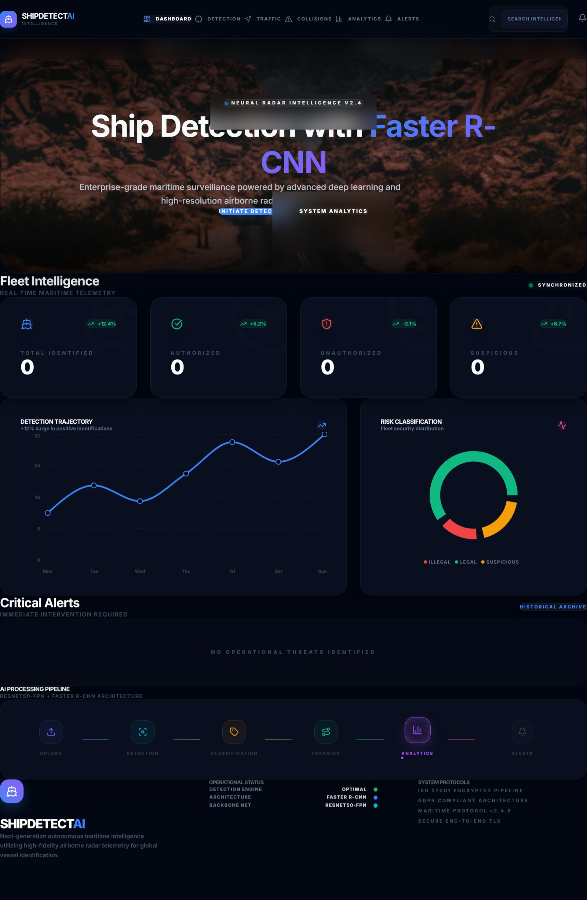
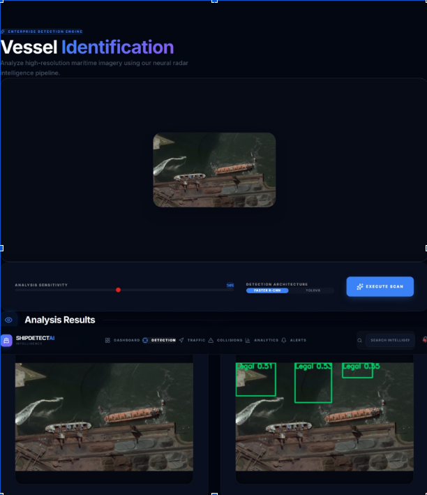

# Ship-Detection-Based-on-Faster-R-CNN-using-Range-Compressed-Airborne-Radar-Data

AI-based maritime surveillance system using Faster R-CNN with ResNet50-FPN for detecting ships from airborne radar images. The project combines deep learning with a modern full-stack web application to provide accurate ship detection, visualization, and analytics.

---

# Dashboard Preview

<p align="center">
  
</p>

The dashboard provides:
- Real-time maritime analytics
- Detection statistics
- Traffic monitoring
- Risk classification
- Detection pipeline visualization

---

# Detection Workflow

<p align="center">
  
</p>

The system processes uploaded radar images, performs ship detection using Faster R-CNN, and visualizes the output with bounding boxes and confidence scores.

---

# Features

- Ship detection using Faster R-CNN
- ResNet50 + Feature Pyramid Network (FPN)
- Radar image preprocessing
- Bounding box generation with confidence scores
- Non-Maximum Suppression (NMS)
- FastAPI backend for model inference
- React frontend for visualization
- Interactive analytics dashboard
- Near real-time detection support

---

# Tech Stack

## Backend
- Python
- PyTorch
- Torchvision
- FastAPI
- OpenCV
- NumPy

## Frontend
- React
- Vite
- Tailwind CSS
- Axios
- Recharts
- Framer Motion

---

# Project Architecture

```
Input Radar Image
        ↓
Preprocessing
        ↓
ResNet50 Feature Extraction
        ↓
Feature Pyramid Network (FPN)
        ↓
Region Proposal Network (RPN)
        ↓
Faster R-CNN Detection
        ↓
Post-Processing (NMS)
        ↓
Bounding Boxes + Confidence Scores
        ↓
Visualization Dashboard
```
---

# Model Details

## Faster R-CNN

Faster R-CNN is a two-stage object detection model:

1. Region Proposal Network (RPN) generates candidate object regions.
2. Classification and bounding box regression localize ships accurately.

## ResNet50 Backbone

Used for extracting deep feature maps from radar images.

## Feature Pyramid Network (FPN)

Improves multi-scale ship detection and enhances small object detection.

---

# Usage

1. Open the frontend application.
2. Upload a radar image.
3. The backend preprocesses the image.
4. Faster R-CNN performs ship detection.
5. Detection results are displayed with:
   - Bounding boxes
   - Confidence scores
   - Analytics dashboard

---

# Detection Pipeline

```
Upload Image
      ↓
Preprocessing
      ↓
AI Inference
      ↓
Ship Detection
      ↓
Post-Processing
      ↓
Result Visualization
```

---
# Results
1. Accurate ship detection in noisy radar environments
2. Reduced false detections compared to CFAR methods
3. Near real-time response
4. Interactive analytics dashboard

---
# Applications
```
Maritime surveillance
Coastal monitoring
Illegal fishing detection
Naval security systems
Port monitoring
Traffic analysis
```
---

# Future Enhancements
```
YOLOv8 integration for faster inference
Real-time radar stream support
Automated alert system
Cloud deployment
Multi-object maritime monitoring
```
---
